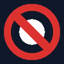

# NoGamble TTV

**Browser extension that hides gambling-promoting streamers from Twitch and Kick.**

---

## What it does

### Twitch
- **Hides** blacklisted streamers from the sidebar, browse, homepage, and all recommendations — no empty space left behind
- **Hides** gambling category tiles (Slots, Casino, Roulette, etc.) from the directory
- **Overlays** a warning when navigating directly to a blacklisted channel or gambling category page
- **Self-exclusion widget** appears on any stream currently live in a blocked gambling category — links to the country's self-exclusion register (11 countries supported) — hover the widget to tip the channel directly
- **Mutes** the stream while the warning overlay is shown, unmutes if the user chooses to proceed
- Responsive to sidebar collapse, theatre mode, and fullscreen

### Kick
- **Hides** blacklisted channels from the following/recommended sidebar and browse cards
- **Hides** blocked category tiles from the categories page
- **Overlays** a warning when navigating directly to a blacklisted channel or blocked category
- **Self-exclusion widget** on blacklisted channel pages and streams playing blocked categories — hover to tip the channel
- Responsive to theatre mode and sidebar state

---

## Tech Stack

| Layer | Technology |
|---|---|
| Framework | [WXT](https://wxt.dev) v0.19 |
| Language | TypeScript (strict) |
| Target | Chrome / Edge (Manifest V3) |
| Twitch blacklist API | [nogamblettv.app/api/blacklist](https://www.nogamblettv.app/api/blacklist) |
| Kick blacklist API | [nogamblettv.app/api/kicklist](https://www.nogamblettv.app/api/kicklist) |
| Twitch categories API | [nogamblettv.app/api/categories](https://www.nogamblettv.app/api/categories) |
| Kick categories API | [nogamblettv.app/api/categories/kick](https://www.nogamblettv.app/api/categories/kick) |

---

## Internationalisation

Self-exclusion widget shown for 11 countries with their national register:

| Country | Registry |
|---------|----------|
| Denmark | ROFUS |
| United Kingdom | GamStop |
| Sweden | Spelpaus |
| Germany | OASIS |
| Netherlands | CRUKS |
| Belgium | EPIS |
| Spain | RGIAJ |
| France | ANJ |
| Italy | RUA |
| Portugal | SRIJ |
| Switzerland | Spielsperre |

Detection is fully client-side — no network calls or IP lookup.

---

## Roadmap

| Phase | Status | Description |
|---|---|---|
| 1 – Prototype | ✅ Done | Hardcoded blacklist, hide + overlay + widget |
| 2 – Remote blacklist | ✅ Done | Live API, admin panel, multi-user, Chrome Web Store |
| 3 – Community | ✅ Done | Wall of Gamblers, nudge messages, flag submissions |
| 4 – Kick support | ✅ Done | Kick content script, Kick blacklist + categories API |

---

## License

MIT — see [LICENSE](LICENSE) for details.
